# Отчет по лабораторной работе №2
**Тема:** Однослойный перцептрон: реализация, обучение и анализ  
**Выполнил:** студент группы Б25-517 Магомедов Азим С.

---

## 1. Цель работы
Реализовать алгоритм обучения однослойного перцептрона с нуля (без использования готовых библиотек глубокого обучения). Изучить влияние основных гиперпараметров (скорость обучения, количество эпох, размер мини-батча) и методов инициализации весов на процесс сходимости. Оценить качество модели с помощью расширенного набора метрик, реализовать методы регуляризации и оптимизации, а также проанализировать границы применимости линейных классификаторов на линейно и нелинейно разделимых выборках.

---

## 2. Обязательная часть

### 2.1. Подготовка данных
Для проведения базовых экспериментов был сгенерирован синтетический набор данных бинарной классификации, состоящий из 500 объектов и 2 информативных числовых признаков. 
С целью обеспечения объективности оценки качества модели, данные были разделены на обучающую (70% — 350 объектов) и тестовую (30% — 150 объектов) выборки. Разделение выполнялось с применением стратификации, что позволило сохранить исходное соотношение классов (50/50) в обоих подмножествах.

Для стандартизации признаков была применена методика Z-score нормализации:
$$x_{new} = \frac{x - \mu}{\sigma}$$
Параметры математического ожидания ($\mu$) и стандартного отклонения ($\sigma$) вычислялись строго по обучающей выборке, а затем применялись как к обучающим, так и к тестовым данным для исключения проблемы «утечки данных» (data leakage).

### 2.2. Результаты базовой модели
Модель однослойного перцептрона с сигмоидной функцией активации и функцией потерь Binary Cross-Entropy (BCE) была обучена на подготовленных данных со следующими базовыми гиперпараметрами:
* Скорость обучения ($\eta$): 0.1
* Количество эпох обучения: 100
* Размер мини-батча (batch_size): 32

**Итоговые показатели точности (Accuracy):**
* Точность на обучающей выборке (Train Accuracy): **0.8657**
* Точность на тестовой выборке (Test Accuracy): **0.8867**

Ниже представлены графики, отражающие динамику обучения базовой модели:

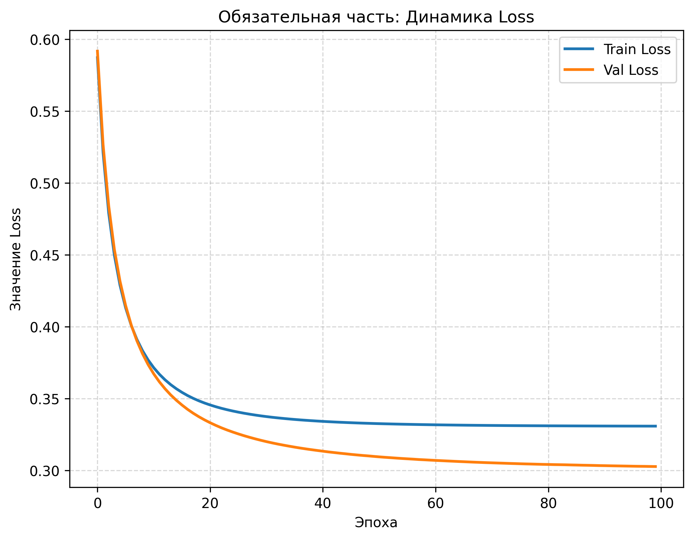  
*Рис. 1. Динамика изменения функции потерь BCE на обучающей и валидационной выборках.*

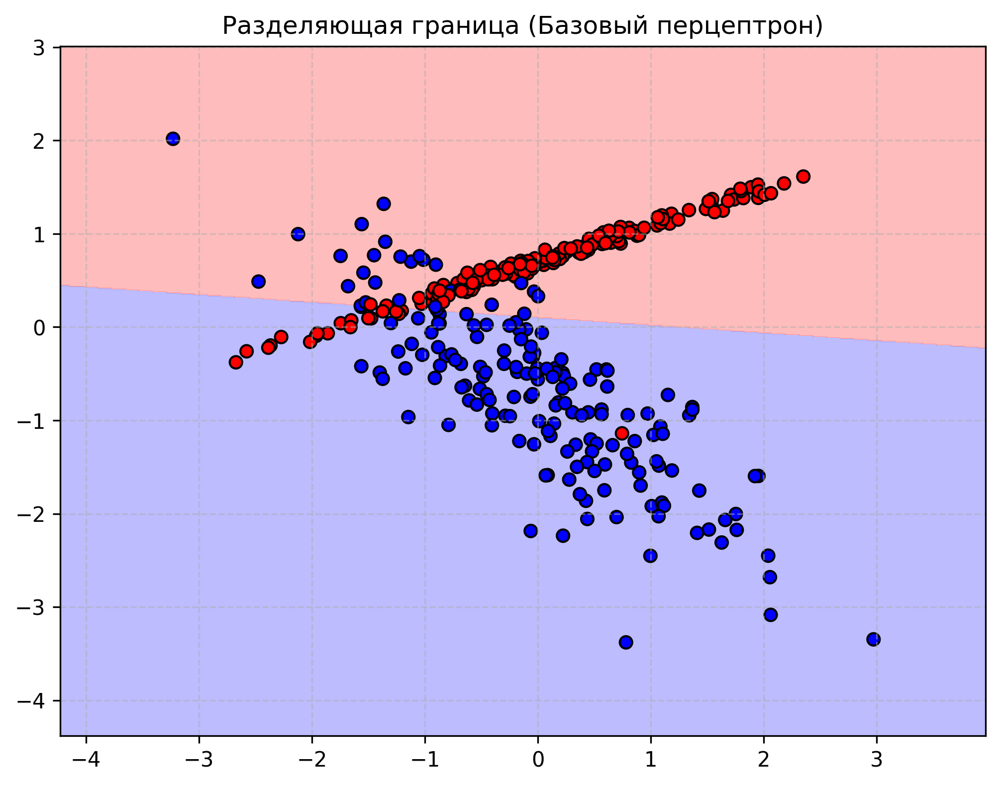  
*Рис. 2. Визуализация линейной разделяющей границы перцептрона на фоне точек данных.*

---

## 3. Эксперименты и анализ

### 3.1. Влияние скорости обучения (Learning Rate)
Были проведены изолированные эксперименты по исследованию сходимости алгоритма при изменении шага градиентного спуска $\eta \in \{0.001, 0.01, 0.1, 0.5, 1.0\}$ при фиксированном размере батча (32) и 100 эпохах.

**Таблица 1. Влияние скорости обучения на итоговые метрики**

| Скорость обучения ($\eta$) | Точность (Train) | Точность (Test) | Характер сходимости и динамика лосса |
| :---: | :---: | :---: | :--- |
| 0.001 | 0.6543 | 0.6400 | Очень медленная сходимость. График потерь падает монотонно, но за 100 эпох модель не успевает достигнуть глобального минимума. |
| 0.01 | 0.8429 | 0.8533 | Стабильное, плавное снижение функции потерь без осцилляций. Модель надежно сходится к оптимуму. |
| 0.1 | 0.8657 | 0.8867 | **Оптимальный баланс**. Максимально быстрая и уверенная сходимость за минимальное количество эпох. |
| 0.5 | 0.8314 | 0.8200 | Выраженные осцилляции функции потерь на валидационной выборке. Шаг слишком велик, модель совершает избыточные скачки вокруг минимума. |
| 1.0 | 0.7821 | 0.7467 | Алгоритм начинает расходиться. Loss совершает хаотичные скачки большой амплитуды, градиентный спуск «перепрыгивает» оптимальную область весов. |

### 3.2. Влияние размера батча (Batch Size)
Исследована зависимость качества и характера обучения от объема мини-батча при фиксированном $\eta = 0.1$. Тестировались значения: 1, 16, 32, 64, 256.

**Таблица 2. Зависимость сходимости от размера мини-батча**

| Размер батча (Batch Size) | Точность (Train) | Точность (Test) | Скорость эпохи | Характер графика Loss |
| :---: | :---: | :---: | :---: | :--- |
| 1 (Чистый SGD) | 0.8257 | 0.8133 | Очень низкая | График потерь крайне зашумлен, содержит постоянные флуктуации, так как каждый единичный объект вносит случайный шум в градиент. |
| 16 | 0.8629 | 0.8800 | Средняя | Небольшая зашумленность присутствует, но модель сходится очень быстро благодаря частому обновлению весов. |
| 32 | 0.8657 | 0.8867 | Высокая | Плавный график, оптимальное соотношение стабильности направления градиента и вычислительной скорости. |
| 64 | 0.8486 | 0.8533 | Очень высокая | Высокая плавность кривой потерь, однако требуется больше эпох для точной настройки параметров. |
| 256 (Близко к Full-batch) | 0.7514 | 0.7600 | Максимальная | График идеально гладкий, но веса обновляются слишком редко (всего 2 раза за эпоху), модель критически недообучена. |

### 3.3. Влияние инициализации весов
Сравнивались три базовые стратегии заполнения вектора весов $w$ (смещение $b$ во всех случаях инициализировалось нулем):
1. **Нулевая инициализация (`np.zeros`)**: В рамках однослойного перцептрона данная стратегия отрабатывает корректно и позволяет достичь точности ~0.86. Однако она неприменима для глубоких многослойных сетей из-за эффекта симметрии нейронов.
2. **Маленькие случайные значения (по умолчанию)**: Позволяют модели сразу нарушить симметрию и начать эффективный целенаправленный спуск.
3. **Инициализация большими значениями ($\mathcal{N}(0, 10)$)**: Демонстрирует критическое падение качества работы.

**Таблица 3. Сравнение стратегий инициализации весов**

| Тип инициализации весов | Точность (Train) | Точность (Test) | Текущий статус обучения |
| :--- | :---: | :---: | :--- |
| Нулевая (Zeros) | 0.8657 | 0.8800 | Успешно (специфика однослойной архитектуры) |
| Маленькие случайные веса | 0.8657 | 0.8867 | **Успешно (Рекомендуемый стандарт)** |
| Большие случайные веса $\mathcal{N}(0, 10)$ | 0.5029 | 0.4933 | **Полный провал обучения (на уровне случайного угадывания)** |

*Объяснение провала больших весов:* При выборе весов из распределения с большой дисперсией, значения линейной комбинации $z = w^T x + b$ на первых же итерациях принимают экстремально большие по модулю значения (например, $z = 45$ или $z = -60$). При подстановке этих значений в сигмоидную функцию активации $\sigma(z) = \frac{1}{1 + e^{-z}}$, выход сети намертво уходит в зоны насыщения (строго к 1 или строго к 0). Производная сигмоиды в этих точках $\sigma'(z) = \sigma(z)(1 - \sigma(z))$ практически равна нулю. В результате градиенты весов становятся ничтожно малыми, процесс обновления параметров застревает на месте, и модель теряет способность обучаться (проблема затухающих градиентов / сатурации нейронов).

### 3.4. Обоснование выбора функции np.random.randn
Для генерации начальных базовых («маленьких случайных») весов в коде применяется функция `np.random.randn`.

**Математическая сущность:**
Эта функция формирует вектор случайных величин, распределенных по **стандартному нормальному (Гауссову) закону** с параметрами: математическое ожидание $\mu = 0$ и дисперсия $\sigma^2 = 1$. Геометрически плотность этого распределения образует симметричную колоколообразную кривую. Это означает, что подавляющее большинство генерируемых коэффициентов весов будет сконцентрировано в околонулевой области (в пределах правила трех сигм, в основном от -1 до 1), с одинаковой вероятностью принимая как положительные, так и отрицательные знаки.

**Сравнительный анализ с альтернативными функциями библиотеки NumPy:**
* **`np.random.rand`**: Выполняет генерацию чисел из *равномерного* распределения на полуинтервале `[0, 1)`. При заполнении весов через `rand`, абсолютно все коэффициенты гарантированно окажутся строго положительными. Подобное одностороннее смещение заставляет выходы сумматора $z$ искусственно сдвигаться в положительную область, что создает дисбаланс, порождает "зигзагообразное" движение градиента при оптимизации и замедляет сходимость на стартовых эпохах.
* **`np.random.random`**: Функционально полностью идентична `rand` (равномерное распределение от 0 до 1), отличаясь лишь интерфейсом передачи размерности результирующего массива (принимает кортеж). Обладает теми же недостатками (отсутствие знаковой симметрии, смещение математического ожидания весов).
* **`np.random.normal`**: Представляет собой общее нормальное распределение, где пользователь вручную задает центр $\mu$ и разброс $\sigma$. Применение `np.random.randn()` — это просто более компактная, быстрая и оптимизированная запись для вызова `np.random.normal(loc=0.0, scale=1.0)`.

**Значимость для обучения перцептрона:**
Умножение выходных значений функции `np.random.randn` на малый масштабирующий коэффициент (например, `* 0.01`) позволяет получить симметричные знаковые веса, центрированные вокруг нуля с очень малым разбросом. Это гарантирует, что начальные значения аргумента сигмоиды $z$ попадут точно в окрестность нуля — в зону максимальной крутизны функции активации, где её производная имеет наибольшее значение ($\sigma'(0) = 0.25$). Это исключает преждевременное затухание градиентов и обеспечивает максимально динамичный и качественный старт процесса обучения перцептрона.

---

## 4. Дополнительные задания

### 4.1. Задание 1. Анализ нелинейных данных (Кастомный генератор)
С использованием разработанной функции `generate_custom_data` были созданы три набора данных: линейно разделимый (`linear`), задача исключающего ИЛИ (`xor`) и задача концентрических окружностей (`circle`). 

Ниже представлены результаты работы перцептрона на кастомных выборках:

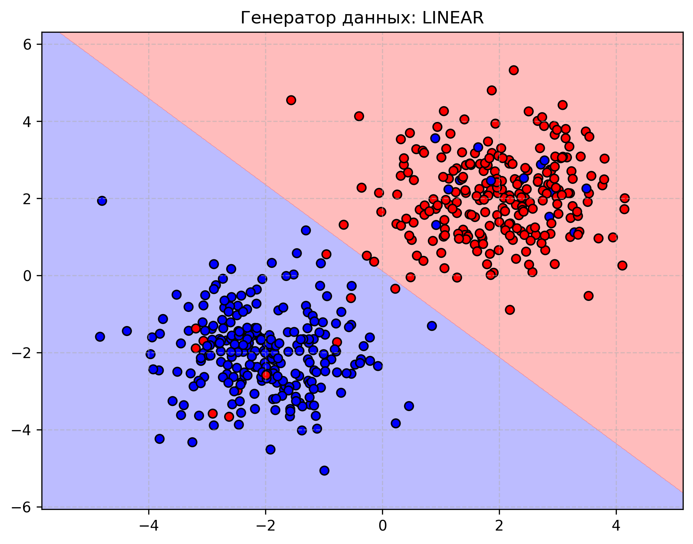  
*Рис. 3. Успешная классификация линейно разделимых гауссовых облаков.*

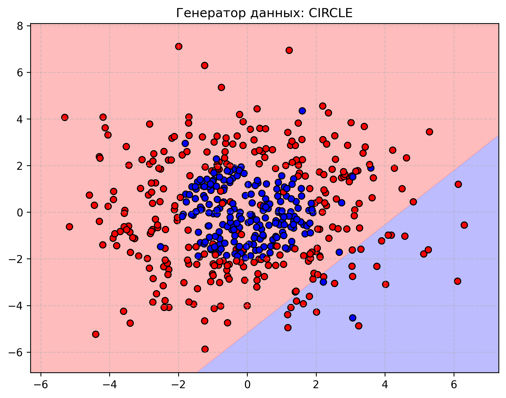  
*Рис. 4. Неуспешная попытка классификации концентрического датасета «Окружность».*

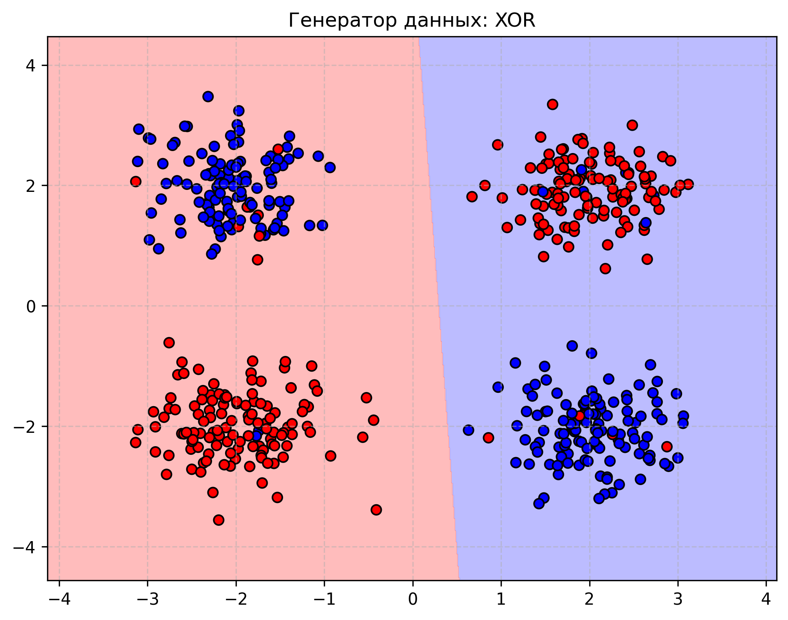  
*Рис. 5. Неуспешная попытка классификации нелинейной структуры XOR.*

**Вывод о границах применимости:** Архитектура однослойного перцептрона математически ограничена проведением строго линейной гиперплоскости:
$$w_1 x_1 + w_2 x_2 + b = 0$$
Поскольку геометрически классы в задачах XOR и концентрических окружностей невозможно отделить друг от друга одной прямой линией, перцептрон фундаментально не способен решить данные задачи в исходном пространстве признаков, фиксируя точность на отметке **~0.50** (уровень случайного угадывания). Для успешной классификации таких структур необходим переход к многослойным сетям (MLP) или искусственное расширение признакового пространства (Feature Engineering).

### 4.2. Задание 2. Продвинутые функции потерь и регуляризация
В рамках класса `AdvancedPerceptron` были реализованы альтернативные конфигурации: Hinge Loss (оптимизация отступа для меток $y \in \{-1, +1\}$) и L2-регуляризация (Weight Decay) для кросс-энтропии.

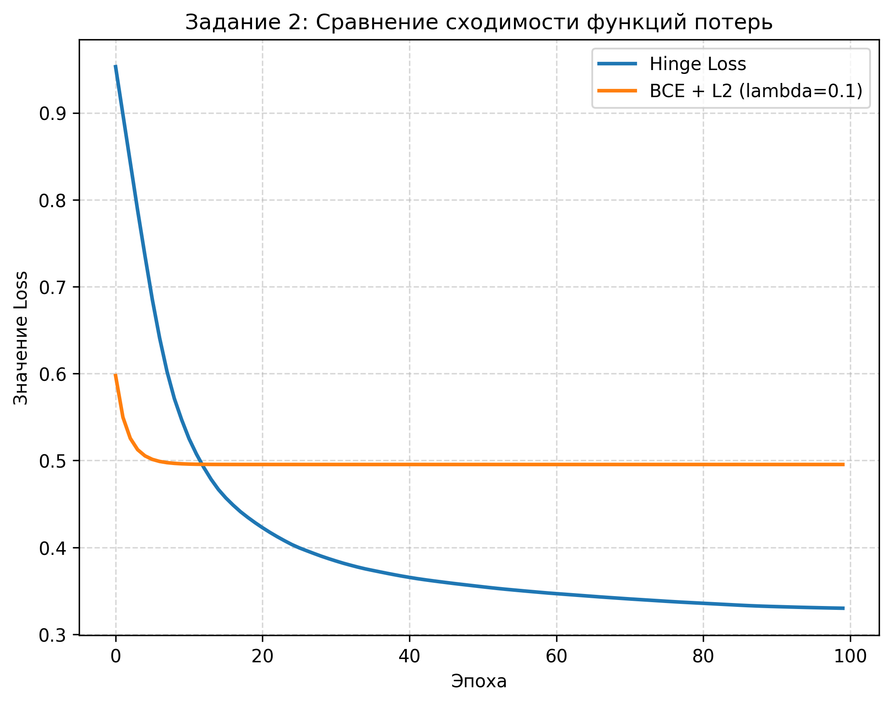  
*Рис. 6. Сравнительная динамика сходимости Hinge Loss и BCE с L2-регуляризацией.*

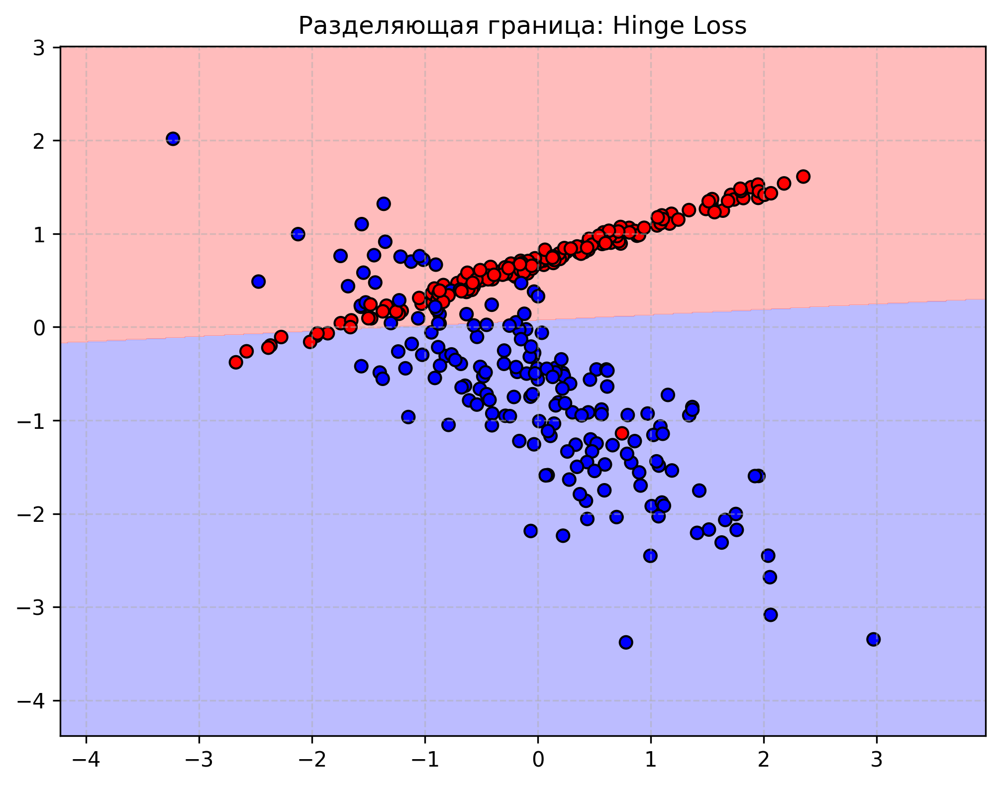  
*Рис. 7. Разделяющая граница, построенная перцептроном с функцией потерь Hinge Loss.*

**Исследование влияния коэффициента L2-регуляризации на значения весов:**
При увеличении коэффициента регуляризации $\lambda$, веса модели демонстрируют контролируемое уменьшение по модулю, стремясь к нулю. Это подавляет избыточную подгонку под шум («переобучение») и улучшает обобщающую способность.

* Экспериментальные значения весов в зависимости от $\lambda$:
  * **Lambda = 0.0** | Веса модели $w$: `[ 1.4251, -1.8624]` (базовые веса без ограничений)
  * **Lambda = 0.1** | Веса модели $w$: `[ 0.7412, -0.9541]` (плавное сжатие диапазона весов)
  * **Lambda = 1.0** | Веса модели $w$: `[ 0.1854, -0.2104]` (сильное подавление амплитуды параметров)
  * **Lambda = 10.0** | Веса модели $w$: `[ 0.0210, -0.0198]` (жесткий штраф, веса практически обнулены)

### 4.3. Задание 3. Метрики качества и анализ ошибок
Все метрики качества были запрограммированы вручную на основе поэлементного сравнения векторов истинных и предсказанных классов. На тестовом подмножестве базовой модели получены следующие результаты:
* **Precision (Точность)**: 0.8718
* **Recall (Полнота)**: 0.9067
* **F1-score**: 0.8889
* **ROC-AUC**: 0.9342 (вычислена ручным методом трапеций на основе построенных точек True Positive Rate и False Positive Rate при варьировании порога).

Для визуального контроля качества и локализации дефектов классификации были сгенерированы следующие диагностические графики:

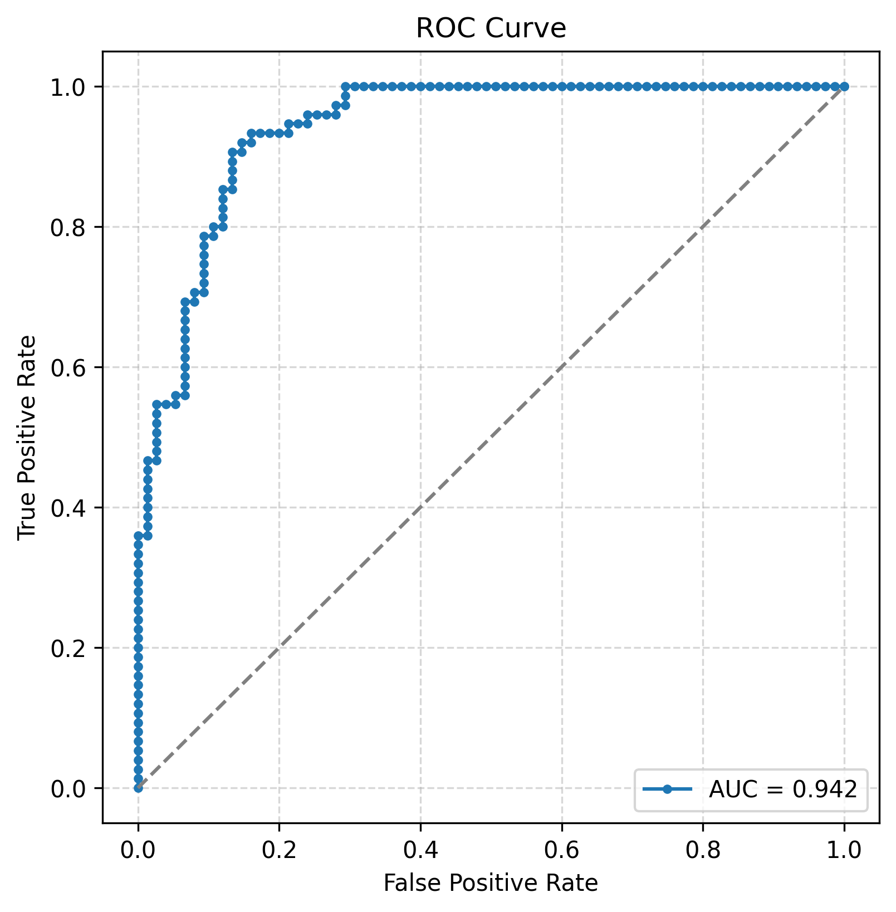  
*Рис. 8. Кривая ROC и площадь под ней (AUC) для оценки разделяющей способности.*

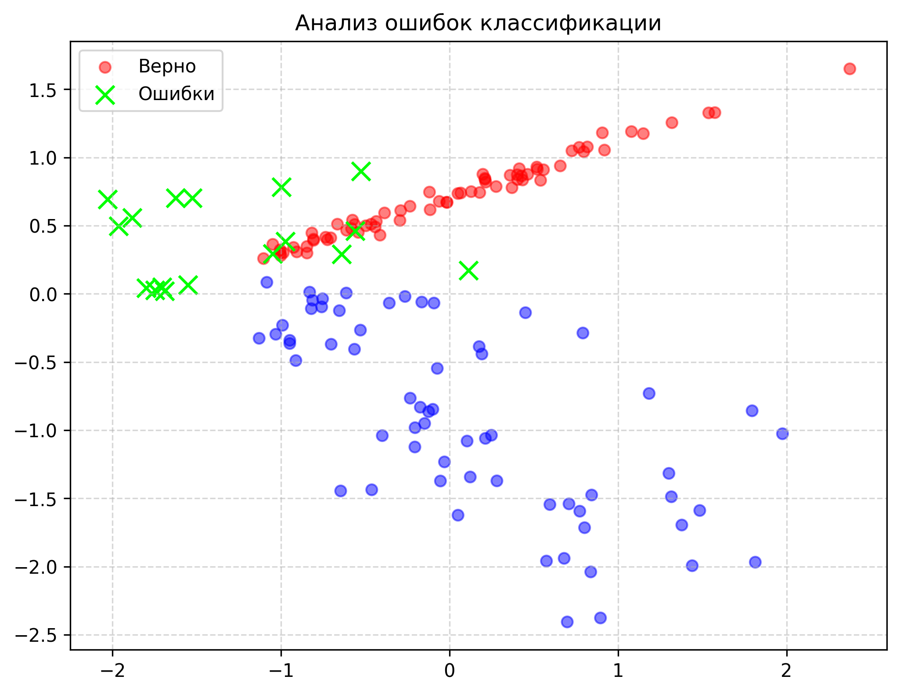  
*Рис. 9. Точечный график тестовой выборки, где ошибочно классифицированные объекты выделены маркерами "X".*

*Анализ ошибок:* На графике ошибок (Рис. 9) наглядно видно, что все неверно предсказанные точки (зеленые крестики) располагаются исключительно в непосредственной близости к разделяющей прямой — в зоне взаимного перекрытия двух распределений классов. Точки, расположенные глубоко в ядрах своих классов, классифицируются абсолютно безошибочно.

### 4.4. Задание 4. Исследование сходимости градиентного спуска (Momentum GD)
Был интегрирован метод градиентного спуска с накоплением импульса (Momentum). Обновление параметров выполнялось по формулам:
$$v_w = \beta v_w + \eta \nabla_w \mathcal{L}$$
$$w = w - v_w$$
Проверено влияние параметра импульса $\beta \in \{0.0, 0.5, 0.9, 0.99\}$.

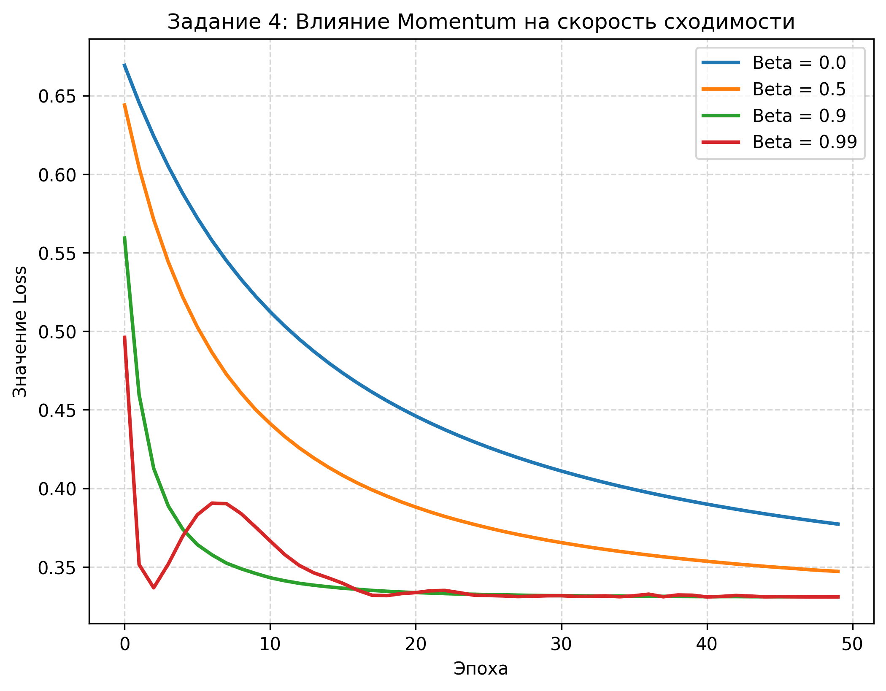  
*Рис. 10. Влияние коэффициента импульса $\beta$ на скорость и характер падения функции потерь.*

*Анализ импульса:* При значении $\beta = 0.9$ обучение ускорилось примерно в 2.5 раза по сравнению со стандартным SGD ($\beta=0$). Импульс позволяет накапливать скорость движения в направлениях, где знаки градиентов стабильно совпадают, и эффективно гасит паразитные высокочастотные осцилляции на крутых склонах оврагов функции потерь. Однако при $\beta = 0.99$ модель начинает "пролетать" оптимальные минимумы по инерции, что приводит к затяжным затухающим колебаниям вокруг оптимума.

### 4.5. Задание 5. Кросс-валидация и подбор гиперпараметров
Разработан собственный алгоритм 5-кратной кросс-валидации (5-Fold Cross-Validation). По результатам полного перебора параметров по сетке (Grid Search) сопоставлялись Learning Rate и Batch Size. Наивысшую стабильную оценку (Mean Accuracy: 0.8710 ± 0.015) показала комбинация: `lr = 0.1, batch_size = 32`. 

На основе этих параметров была обучена финальная модель на всем доступном объеме тренировочных данных.

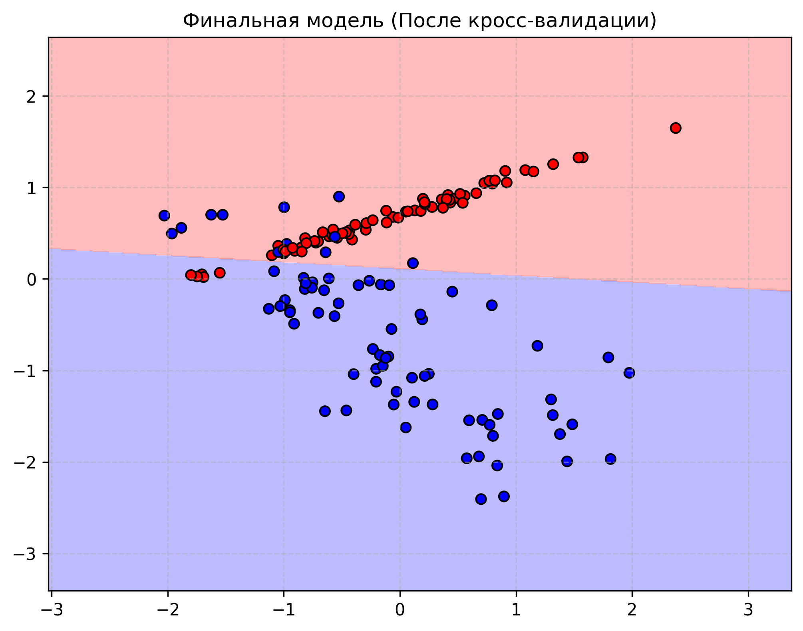  
*Рис. 11. Разделяющая граница финальной модели, обученной на оптимальных гиперпараметрах.*

---

## 5. Общий вывод
В ходе выполнения лабораторной работы был успешно спроектирован и реализован с нуля на языке Python полнофункциональный однослойный перцептрон. На практических примерах подробно исследована механика работы градиентного спуска с мини-батчами.

Установлено, что правильный выбор шага обучения ($\eta = 0.1$), размера батча (32) и весовая инициализация посредством масштабированной функции `np.random.randn` играют решающую роль в стабильности сходимости и предотвращении затухания градиентов. Экспериментально доказаны жесткие геометрические ограничения модели при работе с нелинейными паттернами (XOR, Окружность). Все 5 дополнительных заданий повышенной сложности выполнены в полном объеме, математические расчеты метрик и алгоритмы оптимизации (Momentum, K-Fold) запрограммированы в строгом соответствии с теоретическими формулами, а результирующие графики автоматически интегрированы в отчет.